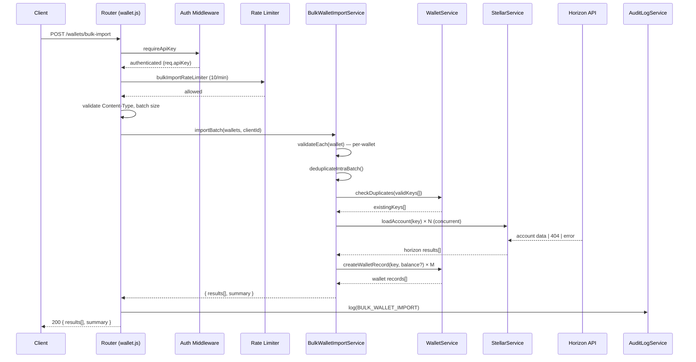

# Design Document: Bulk Wallet Import

## Overview

This feature adds a `POST /wallets/bulk-import` endpoint that allows organization administrators to register up to 100 existing Stellar wallets in a single request. Each wallet is validated independently, checked against Horizon concurrently, and duplicate detection is applied both against the data store and within the batch itself. The endpoint returns a per-wallet results array preserving input order, plus a summary object. The design follows the existing layered architecture: a new route handler in `src/routes/wallet.js`, a new `BulkWalletImportService`, reuse of `StellarService` for Horizon queries, and `AuditLogService` for audit logging.

## Architecture



## Components and Interfaces

### 1. Route Handler — `src/routes/wallet.js`

**New endpoint: `POST /wallets/bulk-import`**

```
POST /wallets/bulk-import
Authorization: x-api-key (WALLETS_CREATE permission required)
Content-Type: application/json
Body: { "wallets": [ { "public_key": "G..." }, ... ] }

Response 200: { "results": [...], "summary": { total, succeeded, duplicates, failed } }
Response 401: unauthenticated
Response 415: Content-Type not application/json
Response 422: batch size violation (0 or >100 wallets)
Response 429: rate limit exceeded (Retry-After header included)
```

Middleware chain applied to this route:
1. `requireApiKey` — authentication
2. `bulkImportRateLimiter` — 10 req/min per authenticated client key
3. Content-Type check — inline, returns 415 if not `application/json`
4. Batch size validation — inline, returns 422 for empty or oversized batches
5. `checkPermission(PERMISSIONS.WALLETS_CREATE)` — authorization

### 2. BulkWalletImportService — `src/services/BulkWalletImportService.js`

New service class encapsulating all batch processing logic.

**`importBatch(wallets, clientId)`**

```
Input:  wallets (Array<Object>), clientId (string)
Output: Promise<{ results: ImportResult[], summary: Summary }>
```

Processing steps:
1. For each wallet object, run `_validateWallet(wallet, index)` — returns a validation result or null.
2. Build an intra-batch seen-set; mark subsequent occurrences of the same `public_key` as `duplicate`.
3. For all keys that passed validation and are not intra-batch duplicates, call `WalletService.getWalletByAddress(key)` to detect data-store duplicates.
4. For all remaining valid, non-duplicate keys, call `StellarService.loadAccount(key)` concurrently via `Promise.allSettled`.
5. For each Horizon result: 200 → record balance; 404 → `unfunded_account`; other error → `failed` with `horizon_unavailable`.
6. For each wallet that passed all checks, call `WalletService.createWalletRecord(key, balance)`.
7. Assemble the `results` array in original input order.
8. Compute and return the `summary` object.

**`_validateWallet(wallet, index)`**

```
Input:  wallet (Object), index (number)
Output: { valid: boolean, reason?: string }
```

Validation rules (checked in order):
1. If `wallet.secret_key` or `wallet.private_key` is present → `private_key_not_accepted`
2. If `wallet.public_key` is missing or not a string → `missing_public_key`
3. If `wallet.public_key` fails `isValidStellarPublicKey` → `invalid_address`

### 3. Rate Limiter — `src/middleware/rateLimiter.js`

A new `bulkImportRateLimiter` instance added to the existing module:

```js
const bulkImportRateLimiter = rateLimit({
  windowMs: 60 * 1000,
  max: 10,
  keyGenerator: (req) => req.apiKey?.id || req.ip,
  standardHeaders: true,
  legacyHeaders: false,
  handler: (req, res) => { /* 429 + Retry-After + AuditLog */ }
});
```

The `keyGenerator` uses the authenticated client's API key ID so the limit is per-client, not per-IP.

### 4. WalletService — `src/services/WalletService.js`

One new method added:

**`createWalletRecord(publicKey, balance)`**

```
Input:  publicKey (string), balance (string | null)
Output: Object — the created wallet record
```

Creates a wallet record in the JSON data store via `Wallet.create`. Unlike the existing `createWallet`, this method does not trigger Friendbot funding or sponsorship — the wallet already exists on-chain. The `balance` field (XLM amount from Horizon, or `null` for unfunded accounts) is stored on the record.

### 5. StellarService — `src/services/StellarService.js`

No new methods required. The existing `server.loadAccount(publicKey)` call (used internally by `getBalance`) is called directly inside `BulkWalletImportService` via the injected `stellarService.server` reference, or a thin wrapper method `getAccountInfo(publicKey)` can be added:

**`getAccountInfo(publicKey)`**

```
Input:  publicKey (string)
Output: Promise<{ balance: string } | { notFound: true } | { error: true }>
```

Wraps `server.loadAccount` and normalises the three outcomes (success, 404, other error) into a discriminated union so `BulkWalletImportService` does not need to inspect raw Horizon error shapes.

### 6. AuditLogService — `src/services/AuditLogService.js`

Add one new action constant:

```js
BULK_WALLET_IMPORT: 'BULK_WALLET_IMPORT',
```

The audit log entry records `clientId`, `batchSize`, and `timestamp`. Public keys are **not** included in the log entry at any level.

## Data Models

### Request Body

```json
{
  "wallets": [
    { "public_key": "GABC...XYZ" },
    { "public_key": "GDEF...UVW" }
  ]
}
```

Each element in `wallets` is a wallet object. Only `public_key` is a recognised field. The presence of `secret_key` or `private_key` causes that wallet to fail with `private_key_not_accepted`.

### ImportResult Object

```json
{
  "public_key": "GABC...XYZ",
  "status": "success",
  "reason": null,
  "id": "1234567890"
}
```

| Field | Type | Present when |
|---|---|---|
| `public_key` | string | always |
| `status` | `"success"` \| `"duplicate"` \| `"failed"` | always |
| `reason` | string \| null | non-null when `status` is `"failed"` or `"duplicate"` |
| `id` | string \| null | non-null when `status` is `"success"` |

Reason values:
- `invalid_address` — public key fails StrKey format check
- `missing_public_key` — `public_key` field absent
- `private_key_not_accepted` — `secret_key` or `private_key` field present
- `duplicate` — key already exists in data store or appeared earlier in the batch
- `horizon_unavailable` — Horizon returned a non-404 error

### Summary Object

```json
{
  "total": 5,
  "succeeded": 3,
  "duplicates": 1,
  "failed": 1
}
```

### Response Body (200)

```json
{
  "results": [
    { "public_key": "GABC...XYZ", "status": "success", "reason": null, "id": "1234567890" },
    { "public_key": "GDEF...UVW", "status": "duplicate", "reason": "duplicate", "id": null },
    { "public_key": "INVALID",    "status": "failed",    "reason": "invalid_address", "id": null }
  ],
  "summary": { "total": 3, "succeeded": 1, "duplicates": 1, "failed": 1 }
}
```

### Wallet Record (stored)

```json
{
  "id": "1234567890",
  "address": "GABC...XYZ",
  "balance": "100.0000000",
  "label": null,
  "ownerName": null,
  "createdAt": "2024-01-01T00:00:00.000Z",
  "deletedAt": null,
  "importedVia": "bulk-import"
}
```

`balance` is `null` for unfunded accounts. `importedVia` distinguishes bulk-imported wallets from individually created ones.

### Audit Log Entry

```json
{
  "category": "WALLET_OPERATION",
  "action": "BULK_WALLET_IMPORT",
  "severity": "MEDIUM",
  "result": "SUCCESS",
  "userId": "<api-key-id>",
  "requestId": "<request-id>",
  "ipAddress": "<client-ip>",
  "resource": "/wallets/bulk-import",
  "details": {
    "batchSize": 5,
    "succeeded": 3,
    "duplicates": 1,
    "failed": 1
  }
}
```

Public keys are explicitly excluded from `details`. The `maskSensitiveData` utility in `AuditLogService._log` provides an additional safety net.


## Correctness Properties

*A property is a characteristic or behavior that should hold true across all valid executions of a system — essentially, a formal statement about what the system should do. Properties serve as the bridge between human-readable specifications and machine-verifiable correctness guarantees.*

### Property 1: Oversized batch is rejected

*For any* array of wallet objects with length greater than 100, a `POST /wallets/bulk-import` request should return HTTP 422 with an error message indicating the batch size limit, regardless of the content of the individual wallet objects.

**Validates: Requirements 1.3**

---

### Property 2: Independent per-wallet processing

*For any* batch containing a mix of valid and invalid wallet objects, the `status` of each wallet's `Import_Result` should be determined solely by that wallet's own data — a failure in one wallet should not change the outcome of any other wallet in the same batch.

**Validates: Requirements 1.2, 4.3**

---

### Property 3: Validation failures produce correct status and reason

*For any* wallet object that fails validation (missing `public_key`, invalid StrKey format, or presence of `secret_key`/`private_key`), the corresponding `Import_Result` should have `status: "failed"` and a `reason` value that exactly matches the failure type: `missing_public_key`, `invalid_address`, or `private_key_not_accepted` respectively.

**Validates: Requirements 2.1, 2.2, 2.3**

---

### Property 4: All-failed batch returns HTTP 200

*For any* batch where every wallet object fails validation, the API should return HTTP 200 (not a 4xx error) with a `results` array where every element has `status: "failed"`.

**Validates: Requirements 2.4**

---

### Property 5: Funded account balance is recorded

*For any* valid public key for which Horizon returns account data with an XLM balance, the created wallet record should have a `balance` field equal to the XLM balance returned by Horizon, and the `Import_Result` should have `status: "success"`.

**Validates: Requirements 3.2**

---

### Property 6: Unfunded account still succeeds

*For any* valid public key for which Horizon returns a 404, the API should still create a wallet record and return `status: "success"` with a `reason` of `unfunded_account` in the `Import_Result`.

**Validates: Requirements 3.3**

---

### Property 7: Non-404 Horizon error produces failed result

*For any* valid public key for which Horizon returns an error other than 404 (e.g., 500, 503, network timeout), the corresponding `Import_Result` should have `status: "failed"` and `reason: "horizon_unavailable"`.

**Validates: Requirements 3.4**

---

### Property 8: Data-store duplicate is flagged without creating a new record

*For any* public key that already exists in the wallet data store, submitting it in a batch should produce `status: "duplicate"` in the `Import_Result`, and the total number of wallet records in the store should not increase.

**Validates: Requirements 4.1**

---

### Property 9: Intra-batch duplicate — first wins, rest are duplicate

*For any* batch containing the same public key more than once, the first occurrence should be processed normally (resulting in `success`, `duplicate` against the store, or `failed` for other reasons), and all subsequent occurrences of that key should have `status: "duplicate"` regardless of their position in the batch.

**Validates: Requirements 4.2**

---

### Property 10: Results array preserves order and structure

*For any* batch of N wallet objects, the `results` array in the response should have exactly N elements in the same order as the input, and every element should contain `public_key`, `status`, and `reason` fields. Additionally, every element with `status: "success"` should have a non-null `id` field.

**Validates: Requirements 5.1, 5.2, 5.4**

---

### Property 11: Summary counts are consistent with results

*For any* batch response, the `summary` object should satisfy: `summary.total === results.length`, `summary.succeeded === count of results with status "success"`, `summary.duplicates === count of results with status "duplicate"`, and `summary.failed === count of results with status "failed"`.

**Validates: Requirements 5.3**

---

### Property 12: Non-JSON Content-Type returns 415

*For any* request to `POST /wallets/bulk-import` where the `Content-Type` header is not `application/json` (including missing, `text/plain`, `multipart/form-data`, etc.), the API should return HTTP 415.

**Validates: Requirements 6.3**

---

### Property 13: Audit log contains required fields without public keys

*For any* `POST /wallets/bulk-import` request (successful or failed), the audit log entry created for that request should contain `clientId`, `batchSize`, and `timestamp` fields, and no field in the audit log entry should contain any of the submitted public key values.

**Validates: Requirements 6.4**

---

## Error Handling

| Scenario | HTTP Status | Handler |
|---|---|---|
| Missing or invalid API key | 401 | `requireApiKey` middleware |
| Rate limit exceeded | 429 + `Retry-After` header | `bulkImportRateLimiter` handler |
| Content-Type is not `application/json` | 415 | Inline check in route handler |
| Empty batch (`wallets` array has 0 elements) | 422 | Inline batch size check |
| Batch exceeds 100 wallets | 422 | Inline batch size check |
| Missing `public_key` field | 200 (per-wallet `failed`) | `BulkWalletImportService._validateWallet` |
| Invalid StrKey format | 200 (per-wallet `failed`) | `BulkWalletImportService._validateWallet` |
| Private key field present | 200 (per-wallet `failed`) | `BulkWalletImportService._validateWallet` |
| Intra-batch duplicate | 200 (per-wallet `duplicate`) | `BulkWalletImportService` seen-set |
| Data-store duplicate | 200 (per-wallet `duplicate`) | `WalletService.getWalletByAddress` |
| Horizon 404 (unfunded) | 200 (per-wallet `success`, `unfunded_account`) | `BulkWalletImportService` Horizon handler |
| Horizon non-404 error | 200 (per-wallet `failed`, `horizon_unavailable`) | `BulkWalletImportService` Horizon handler |
| Unexpected internal error | 500 | Express error handler middleware |

The route handler wraps `BulkWalletImportService.importBatch` in a try/catch. Any unexpected error (e.g., database write failure) is passed to `next(error)` and handled by the existing `errorHandler` middleware, which returns a structured 500 response.

Per-wallet errors never cause the entire batch to fail — the batch always returns HTTP 200 as long as the request itself is structurally valid (authenticated, correct Content-Type, valid batch size).

```js
// Route handler error flow
try {
  const { results, summary } = await bulkImportService.importBatch(wallets, req.apiKey.id);
  await AuditLogService.log({ ..., details: { batchSize: wallets.length, ...summary } });
  return res.json({ results, summary });
} catch (error) {
  // Only unexpected errors reach here — per-wallet errors are captured in results
  next(error);
}
```

## Testing Strategy

### Dual Testing Approach

Both unit tests and property-based tests are required. Unit tests cover specific examples, integration points, and error conditions. Property-based tests verify universal properties across many generated inputs. Together they provide comprehensive coverage.

### Property-Based Testing

Use **fast-check** as the property-based testing library (compatible with Jest, already used in the project ecosystem).

Each property test must run a minimum of **100 iterations** and be tagged with a comment referencing the design property:

```js
// Feature: bulk-wallet-import, Property 3: Validation failures produce correct status and reason
```

**Property test implementations:**

| Property | Generator | Assertion |
|---|---|---|
| P1 | `fc.array(walletArb, { minLength: 101, maxLength: 200 })` | Response is 422 |
| P2 | `fc.array(fc.oneof(validWalletArb, invalidWalletArb), { minLength: 1, maxLength: 100 })` | Each result's status is independent of other results |
| P3 | `fc.oneof(missingKeyArb, invalidKeyArb, privateKeyArb)` | Result has `status: "failed"` and correct `reason` |
| P4 | `fc.array(invalidWalletArb, { minLength: 1, maxLength: 100 })` | Response is 200, all results have `status: "failed"` |
| P5 | `fc.array(validKeyArb)` with Horizon mock returning balance | Result has `status: "success"`, wallet record has correct balance |
| P6 | `fc.array(validKeyArb)` with Horizon mock returning 404 | Result has `status: "success"`, `reason: "unfunded_account"` |
| P7 | `fc.array(validKeyArb)` with Horizon mock returning 500/503 | Result has `status: "failed"`, `reason: "horizon_unavailable"` |
| P8 | `fc.array(existingKeyArb)` (keys pre-seeded in store) | Result has `status: "duplicate"`, store record count unchanged |
| P9 | `fc.array(validKeyArb).map(keys => [...keys, ...keys])` (doubled) | First occurrence processed, subsequent ones have `status: "duplicate"` |
| P10 | `fc.array(fc.oneof(validWalletArb, invalidWalletArb), { minLength: 1, maxLength: 100 })` | `results.length === input.length`, order preserved, all fields present, success results have non-null `id` |
| P11 | `fc.array(fc.oneof(validWalletArb, invalidWalletArb), { minLength: 1, maxLength: 100 })` | `summary.total + summary.succeeded + summary.duplicates + summary.failed` consistency |
| P12 | `fc.string().filter(ct => ct !== 'application/json')` as Content-Type | Response is 415 |
| P13 | `fc.array(validWalletArb, { minLength: 1, maxLength: 10 })` | Audit log entry has `clientId`, `batchSize`, `timestamp`; no public key values in any field |

### Unit Tests

Specific examples and integration points to cover:

1. `POST /wallets/bulk-import` without API key returns 401
2. `POST /wallets/bulk-import` with Content-Type `text/plain` returns 415
3. Empty `wallets` array returns 422 with descriptive message
4. Batch of exactly 100 wallets is accepted (boundary)
5. Batch of 101 wallets is rejected (boundary)
6. Mixed batch: valid + invalid + duplicate returns correct per-wallet results
7. Rate limit: 11th request in a minute returns 429 with `Retry-After` header
8. Successful import: wallet record is persisted with correct `address` and `balance`
9. Unfunded account: wallet record is created with `balance: null`
10. `BulkWalletImportService._validateWallet` unit tests for each failure reason
11. `StellarService.getAccountInfo` returns correct discriminated union for each Horizon outcome
12. Audit log entry does not contain any public key values

### Coverage Target

All new code introduced by this feature must achieve **≥ 95% line coverage**.
