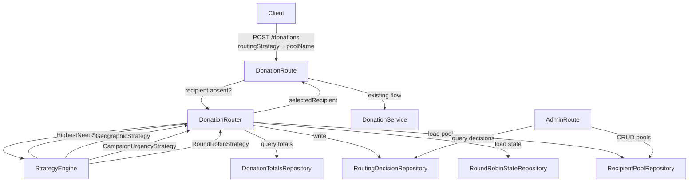

# Design Document: Smart Donation Routing

## Overview

Smart donation routing adds an automatic recipient-selection layer to the existing donation pipeline. When a donor submits a donation without specifying a recipient, the `DonationRouter` service picks one from a named `Recipient_Pool` using one of four deterministic strategies: `highest-need`, `geographic`, `campaign-urgency`, or `round-robin`. Every selection produces an immutable `Routing_Decision` audit record stored before the donation is confirmed.

The feature integrates with the existing `DonationService` and `POST /donations` flow. New admin endpoints manage pools and query audit records. No changes are required to the Stellar transaction layer.

---

## Architecture



The `DonationRouter` is a pure service — it has no HTTP knowledge. The existing `donation.js` route calls it when `routingStrategy` is present and `recipient` is absent. Admin operations live under `/admin/routing`.

---

## Components and Interfaces

### DonationRouter

Central orchestrator. Validates the strategy name, loads the pool, delegates to the appropriate strategy, persists the `Routing_Decision`, and returns the selected recipient.

```js
class DonationRouter {
  constructor({ recipientPoolRepo, routingDecisionRepo, roundRobinStateRepo, donationTotalsRepo })

  // Returns { recipientId, recipientName, routingDecisionId }
  async route({ poolName, routingStrategy, donorCoordinates, donationId, now })
}
```

### Strategy Engine

Each strategy is a stateless function (or small class) with a single `select(pool, context)` method. The `DonationRouter` picks the right one by name.

| Strategy class | Input context fields |
|---|---|
| `HighestNeedStrategy` | `donationTotals: Map<recipientId, number>` |
| `GeographicStrategy` | `donorLat, donorLon` |
| `CampaignUrgencyStrategy` | `now: Date` |
| `RoundRobinStrategy` | `currentIndex: number` |

All strategies return `{ selectedId, excludedIds }`. Excluded recipients (missing coordinates, missing deadline) are recorded in the audit trail.

Tiebreaking is handled uniformly: when multiple candidates share the winning score, the one with the lexicographically smallest `id` string is chosen.

### RecipientPoolRepository

Wraps the `recipient_pools` and `recipient_pool_members` SQLite tables.

```js
class RecipientPoolRepository {
  async create(name, recipientIds)
  async getByName(name)           // throws NotFoundError if absent
  async addMembers(name, ids)
  async removeMembers(name, ids)  // throws ValidationError if id not in pool
  async delete(name)
  async listMembers(name)         // returns Recipient[]
}
```

### RoundRobinStateRepository

Persists the per-pool counter in the `round_robin_state` SQLite table.

```js
class RoundRobinStateRepository {
  async getIndex(poolName)                  // returns 0 if no row exists
  async incrementAndWrap(poolName, poolSize) // atomic update, returns new index
  async reset(poolName)
}
```

### RoutingDecisionRepository

Persists immutable `Routing_Decision` records.

```js
class RoutingDecisionRepository {
  async create(decision)
  async findByDonationId(donationId)
  async findByPoolName(poolName)
  async findByStrategy(strategy)
}
```

### DonationTotalsRepository

Queries the existing `transactions` table to compute per-recipient totals within a lookback window.

```js
class DonationTotalsRepository {
  // Returns Map<recipientId, totalAmount>
  async getTotalsForPool(recipientIds, lookbackWindowMs)
}
```

### Admin Route: `/admin/routing`

```
POST   /admin/routing/pools                    — create pool
GET    /admin/routing/pools/:name              — get pool members
POST   /admin/routing/pools/:name/members      — add members
DELETE /admin/routing/pools/:name/members      — remove members
DELETE /admin/routing/pools/:name              — delete pool
GET    /admin/routing/decisions                — query decisions (filters: donationId, poolName, strategy)
```

All admin endpoints require `requireApiKey` + `requireAdmin()` middleware, matching the existing pattern in `src/routes/admin/`.

### Donation Route Integration

`POST /donations` gains two optional fields: `routingStrategy` (string) and `poolName` (string). When `recipient` is absent and `routingStrategy` is present, the route calls `DonationRouter.route(...)` before delegating to `DonationService`. The resolved recipient is injected as if the donor had specified it directly.

---

## Data Models

### `recipient_pools` table

```sql
CREATE TABLE IF NOT EXISTS recipient_pools (
  id        INTEGER PRIMARY KEY AUTOINCREMENT,
  name      TEXT    NOT NULL UNIQUE,
  createdAt DATETIME DEFAULT CURRENT_TIMESTAMP
);
```

### `recipient_pool_members` table

```sql
CREATE TABLE IF NOT EXISTS recipient_pool_members (
  pool_name    TEXT NOT NULL REFERENCES recipient_pools(name) ON DELETE CASCADE,
  recipient_id TEXT NOT NULL,
  -- recipient metadata cached at insert time for geographic / campaign-urgency
  latitude     REAL,
  longitude    REAL,
  campaign_deadline DATETIME,
  display_name TEXT,
  PRIMARY KEY (pool_name, recipient_id)
);
```

Recipient metadata (coordinates, deadline, display name) is supplied by the admin when adding members to a pool. This avoids cross-service lookups at routing time and keeps the router self-contained.

### `round_robin_state` table

```sql
CREATE TABLE IF NOT EXISTS round_robin_state (
  pool_name   TEXT PRIMARY KEY,
  next_index  INTEGER NOT NULL DEFAULT 0,
  updatedAt   DATETIME DEFAULT CURRENT_TIMESTAMP
);
```

### `routing_decisions` table

```sql
CREATE TABLE IF NOT EXISTS routing_decisions (
  id              TEXT PRIMARY KEY,   -- UUID
  donation_id     TEXT NOT NULL,
  pool_name       TEXT NOT NULL,
  strategy        TEXT NOT NULL,
  selected_id     TEXT NOT NULL,
  candidates      TEXT NOT NULL,      -- JSON array of recipientIds considered
  excluded        TEXT NOT NULL,      -- JSON array of {id, reason} objects
  decided_at      DATETIME NOT NULL,
  createdAt       DATETIME DEFAULT CURRENT_TIMESTAMP
);

CREATE INDEX IF NOT EXISTS idx_rd_donation  ON routing_decisions(donation_id);
CREATE INDEX IF NOT EXISTS idx_rd_pool      ON routing_decisions(pool_name);
CREATE INDEX IF NOT EXISTS idx_rd_strategy  ON routing_decisions(strategy);
```

The `routing_decisions` table has no UPDATE path — records are insert-only.

### Routing_Decision object (in-memory / API shape)

```js
{
  id: string,           // UUID
  donationId: string,
  poolName: string,
  strategy: string,     // 'highest-need' | 'geographic' | 'campaign-urgency' | 'round-robin'
  selectedId: string,
  candidates: string[], // ordered list of all recipients considered
  excluded: [{ id: string, reason: string }],
  decidedAt: string     // ISO 8601
}
```

### Recipient object (pool member shape)

```js
{
  id: string,
  displayName: string,
  latitude: number | null,
  longitude: number | null,
  campaignDeadline: string | null  // ISO 8601
}
```

### Donation_Request additions

```js
{
  // existing fields ...
  routingStrategy: 'highest-need' | 'geographic' | 'campaign-urgency' | 'round-robin',  // optional
  poolName: string,          // required when routingStrategy is present
  donorLatitude: number,     // required for 'geographic'
  donorLongitude: number     // required for 'geographic'
}
```

### Donation response additions (when routed)

```js
{
  // existing fields ...
  routing: {
    recipientId: string,
    recipientName: string,
    routingDecisionId: string
  }
}
```

---

## Correctness Properties

*A property is a characteristic or behavior that should hold true across all valid executions of a system — essentially, a formal statement about what the system should do. Properties serve as the bridge between human-readable specifications and machine-verifiable correctness guarantees.*

### Property 1: Selected recipient is always a pool member

*For any* pool containing at least one recipient and any valid routing strategy, the recipient returned by `DonationRouter.route()` must be a member of that pool.

**Validates: Requirements 1.1**

---

### Property 2: Unrecognized strategy names are always rejected

*For any* string that is not one of `highest-need`, `geographic`, `campaign-urgency`, or `round-robin`, calling `DonationRouter.route()` with that strategy must throw a validation error.

**Validates: Requirements 1.3, 1.4**

---

### Property 3: Highest-need always selects the minimum-total recipient

*For any* pool of recipients with arbitrary donation totals, `HighestNeedStrategy.select()` must return the recipient whose total is strictly less than or equal to every other recipient's total. When multiple recipients share the minimum, the one with the lexicographically smallest `id` is returned.

**Validates: Requirements 2.1, 2.2, 2.3**

---

### Property 4: Geographic always selects the nearest recipient with coordinates

*For any* pool of recipients where at least one has registered coordinates, and any donor coordinates, `GeographicStrategy.select()` must return the recipient whose Haversine distance to the donor is less than or equal to every other eligible recipient's distance. Recipients without coordinates are excluded. When multiple recipients share the minimum distance, the lexicographically smallest `id` is returned.

**Validates: Requirements 3.1, 3.2, 3.3, 3.5**

---

### Property 5: Campaign-urgency always selects the soonest future deadline

*For any* pool of recipients where at least one has a future campaign deadline, `CampaignUrgencyStrategy.select()` must return the recipient whose deadline is closest to but not before `now`. Recipients without a deadline are excluded. When multiple recipients share the nearest deadline, the lexicographically smallest `id` is returned.

**Validates: Requirements 4.1, 4.2, 4.3, 4.5**

---

### Property 6: Round-robin index wraps correctly

*For any* pool of size N, after exactly N consecutive round-robin selections the `Round_Robin_State` index must return to the value it held before those N selections (i.e., the sequence is cyclic with period N).

**Validates: Requirements 5.1, 5.2**

---

### Property 7: Round-robin state persists across reloads

*For any* pool and any index value written to `RoundRobinStateRepository`, reading the index back after a simulated restart (re-instantiating the repository) must return the same value.

**Validates: Requirements 5.3**

---

### Property 8: Pool membership operations are consistent

*For any* pool created with an initial member set S, after any sequence of add and remove operations the members returned by `RecipientPoolRepository.listMembers()` must equal the set S plus all added members minus all removed members.

**Validates: Requirements 6.1, 6.2, 6.3, 6.4**

---

### Property 9: Duplicate pool names are always rejected

*For any* pool name that already exists in the repository, a second `create()` call with the same name must throw a conflict error.

**Validates: Requirements 6.6**

---

### Property 10: Operations on non-existent pools always return not-found

*For any* pool name that has not been created (or has been deleted), any read, add-member, remove-member, or route operation targeting that name must throw a not-found error.

**Validates: Requirements 6.7**

---

### Property 11: Empty pools always reject routing requests

*For any* pool that contains zero members, `DonationRouter.route()` must throw a validation error regardless of the strategy.

**Validates: Requirements 6.9**

---

### Property 12: Routing_Decision records are complete and retrievable

*For any* successful call to `DonationRouter.route()`, the resulting `Routing_Decision` stored in `RoutingDecisionRepository` must contain: `donationId`, `poolName`, `strategy`, `selectedId`, a non-empty `candidates` array, an `excluded` array, and a `decidedAt` timestamp. The record must be retrievable by `donationId`, `poolName`, and `strategy`.

**Validates: Requirements 7.1, 7.2, 7.3**

---

### Property 13: Routing_Decision records are immutable

*For any* `Routing_Decision` record that has been persisted, any subsequent attempt to update or overwrite it must either be rejected or leave the stored record unchanged.

**Validates: Requirements 7.4**

---

### Property 14: Successful routing response contains required fields

*For any* successful routing operation, the donation response payload must include `routing.recipientId`, `routing.recipientName`, and `routing.routingDecisionId`.

**Validates: Requirements 8.1, 8.2**

---

## Error Handling

| Condition | HTTP status | Error code |
|---|---|---|
| Missing both `recipient` and `routingStrategy` | 400 | `ROUTING_STRATEGY_REQUIRED` |
| Unrecognized `routingStrategy` value | 400 | `INVALID_ROUTING_STRATEGY` |
| `poolName` absent when `routingStrategy` present | 400 | `POOL_NAME_REQUIRED` |
| Pool not found | 404 | `POOL_NOT_FOUND` |
| Pool is empty | 422 | `POOL_EMPTY` |
| Duplicate pool name on create | 409 | `POOL_ALREADY_EXISTS` |
| Remove non-member recipient | 422 | `RECIPIENT_NOT_IN_POOL` |
| Geographic strategy — donor coordinates missing | 400 | `DONOR_COORDINATES_REQUIRED` |
| Geographic strategy — no eligible recipients (all lack coordinates) | 422 | `NO_ELIGIBLE_RECIPIENTS` |
| Campaign-urgency — all deadlines expired | 422 | `NO_ACTIVE_CAMPAIGNS` |

All error responses follow the existing `{ success: false, error: { code, message } }` envelope used throughout the codebase.

New error codes are added to `src/utils/errors.js` in the business logic range (5000–5099).

---

## Testing Strategy

### Unit tests

Focus on specific examples and edge cases:

- Each strategy with a hand-crafted pool (known totals, coordinates, deadlines)
- Tiebreaker resolution for each strategy
- Haversine formula against reference values (e.g., known city-pair distances)
- Error paths: empty pool, missing coordinates, all-expired deadlines, unknown strategy
- `RoutingDecisionRepository` insert-only enforcement
- Round-robin wrap at pool boundary (size 1, size 2, size N)

### Property-based tests

Use a property-based testing library (e.g., `fast-check` for JavaScript) with a minimum of 100 iterations per property.

Each test is tagged with a comment in the format:
`// Feature: smart-donation-routing, Property <N>: <property_text>`

One property-based test per correctness property listed above:

| Test | Property |
|---|---|
| Selected recipient is always a pool member | Property 1 |
| Unrecognized strategy names are always rejected | Property 2 |
| Highest-need selects minimum-total recipient | Property 3 |
| Geographic selects nearest eligible recipient | Property 4 |
| Campaign-urgency selects soonest future deadline | Property 5 |
| Round-robin index wraps correctly | Property 6 |
| Round-robin state persists across reloads | Property 7 |
| Pool membership operations are consistent | Property 8 |
| Duplicate pool names are rejected | Property 9 |
| Non-existent pool operations return not-found | Property 10 |
| Empty pools reject routing | Property 11 |
| Routing_Decision records are complete and retrievable | Property 12 |
| Routing_Decision records are immutable | Property 13 |
| Successful routing response contains required fields | Property 14 |
