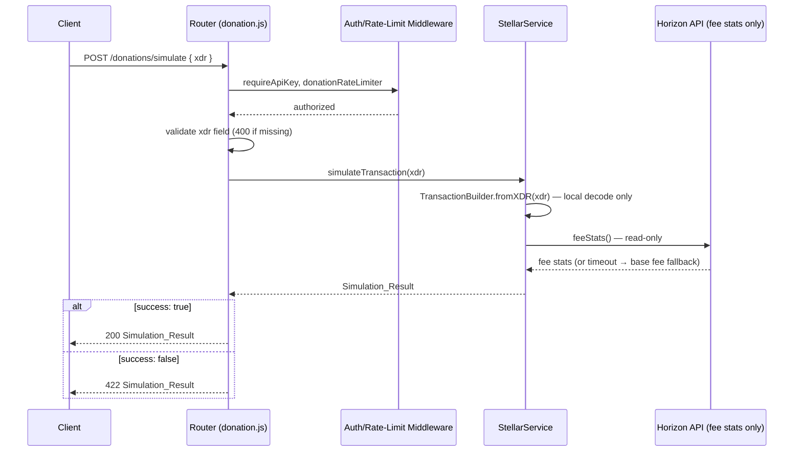

# Design Document: Stellar Transaction Simulation

## Overview

This feature adds a dry-run simulation endpoint to the Stellar integration. Clients submit a base64-encoded transaction XDR to `POST /donations/simulate` and receive a `Simulation_Result` — including estimated fee and expected operation outcomes — without the transaction ever touching the Stellar network.

The implementation follows the existing layered architecture: a new `simulateTransaction(xdr)` method on `StellarService` (and its mock), a new route handler in `src/routes/donation.js`, and a new abstract stub in `StellarServiceInterface`. No new database tables or background jobs are required.

## Architecture



Key invariant: `StellarService.simulateTransaction` never calls `server.submitTransaction`, `server.submitAsyncTransaction`, or any equivalent submission endpoint. The only outbound Horizon call is the read-only `feeStats()` query.

## Components and Interfaces

### 1. StellarServiceInterface — `src/services/interfaces/StellarServiceInterface.js`

Add one abstract stub:

```js
async simulateTransaction(_xdr) {
  void _xdr;
  throw new Error('simulateTransaction() must be implemented');
}
```

### 2. StellarService — `src/services/StellarService.js`

New public method:

```
simulateTransaction(xdr: string): Promise<Simulation_Result>
```

Implementation steps:
1. If `xdr` is falsy or not a string, return `{ success: false, errors: ['xdr is required'] }` immediately (no network call).
2. Attempt `StellarSdk.TransactionBuilder.fromXDR(xdr, this.networkPassphrase)` inside a try/catch. On parse failure, return `{ success: false, errors: [descriptive message], ... }`.
3. Count operations from the decoded transaction (`tx.operations.length`).
4. Fetch fee stats via `this.server.feeStats()` (wrapped in try/catch). On failure, use `StellarSdk.BASE_FEE` (100 stroops) and set `feeWarning`.
5. Calculate `estimatedFeeStroops = recommendedFeePerOp * operationCount`.
6. Build `estimatedResult` by inspecting `tx.operations[0]` (type, source, destination).
7. Return a fully-populated `Simulation_Result` with `success: true`.

The method is annotated with a JSDoc comment explicitly stating it never submits to the network.

### 3. MockStellarService — `src/services/MockStellarService.js`

New public method with the same signature:

```
simulateTransaction(xdr: string): Promise<Simulation_Result>
```

Behavior:
- If `xdr` is falsy/empty/null, return `{ success: false, errors: ['xdr is required and must be a non-empty string'], ... }`.
- If `failureSimulation.enabled`, return `{ success: false, errors: [configured failure message], ... }`.
- Otherwise return `{ success: true, estimatedFee: { stroops: configuredFee * 1, xlm: ... }, estimatedResult: { operationType: 'payment', ... }, simulatedAt: ... }`.
- Never calls any real Horizon endpoint.

### 4. Route Handler — `src/routes/donation.js`

New endpoint registered before the existing `POST /` handler:

```
POST /donations/simulate
Middleware: requireApiKey, donationRateLimiter, simulateSchema
```

Schema validation (`simulateSchema`):

```js
const simulateSchema = validateSchema({
  body: {
    fields: {
      xdr: { type: 'string', required: true, trim: true, minLength: 1 },
    },
  },
});
```

Handler logic:

```js
router.post('/simulate', payloadSizeLimiter(ENDPOINT_LIMITS.singleDonation),
  donationRateLimiter, requireApiKey, simulateSchema, async (req, res, next) => {
  try {
    const { xdr } = req.body;
    const result = await stellarService.simulateTransaction(xdr);
    if (!result.success) {
      return res.status(422).json({ success: false, data: result });
    }
    return res.status(200).json({ success: true, data: result });
  } catch (error) {
    log.error('DONATION_ROUTE', 'Unexpected error during simulation', {
      requestId: req.id, error: error.message,
    });
    return res.status(500).json({ success: false, error: 'Internal server error' });
  }
});
```

HTTP status mapping:

| Condition | Status |
|---|---|
| Missing/empty `xdr` field | 400 (schema middleware) |
| `simulateTransaction` returns `success: false` | 422 |
| `simulateTransaction` returns `success: true` | 200 |
| Unexpected thrown error | 500 (no stack trace exposed) |

## Data Models

### Request Body

```json
{
  "xdr": "<base64-encoded Stellar transaction envelope>"
}
```

### Simulation_Result (success)

```json
{
  "success": true,
  "estimatedFee": {
    "stroops": 100,
    "xlm": "0.0000100"
  },
  "estimatedResult": {
    "operationType": "payment",
    "sourceAccount": "GABC...XYZ",
    "destinationAccount": "GDEST...XYZ"
  },
  "simulatedAt": "2024-01-01T00:00:00.000Z"
}
```

### Simulation_Result (failure)

```json
{
  "success": false,
  "estimatedFee": {
    "stroops": 100,
    "xlm": "0.0000100"
  },
  "errors": [
    "Failed to decode XDR: invalid base64 encoding"
  ],
  "simulatedAt": "2024-01-01T00:00:00.000Z"
}
```

### Simulation_Result (fee fallback)

When Horizon fee stats are unavailable, the result includes an additional `feeWarning` field:

```json
{
  "success": true,
  "estimatedFee": {
    "stroops": 100,
    "xlm": "0.0000100"
  },
  "feeWarning": "Fee estimate is based on the Stellar network base fee (100 stroops/op); live fee stats were unavailable.",
  "estimatedResult": { ... },
  "simulatedAt": "2024-01-01T00:00:00.000Z"
}
```

### HTTP Response Envelope

The route wraps `Simulation_Result` in the standard envelope:

```json
{ "success": true,  "data": { ...Simulation_Result } }
{ "success": false, "data": { ...Simulation_Result } }   // 422
{ "success": false, "error": "Internal server error" }   // 500
```

## Correctness Properties

*A property is a characteristic or behavior that should hold true across all valid executions of a system — essentially, a formal statement about what the system should do. Properties serve as the bridge between human-readable specifications and machine-verifiable correctness guarantees.*

### Property 1: No network submission during simulation

*For any* XDR string (valid, invalid, or empty), calling `StellarService.simulateTransaction` must never invoke `server.submitTransaction`, `server.submitAsyncTransaction`, or any equivalent Horizon submission method.

**Validates: Requirements 1.2, 1.6, 5.1, 5.2**

---

### Property 2: Successful simulation result schema

*For any* valid base64-encoded Stellar transaction XDR, `simulateTransaction` should return a `Simulation_Result` where `success` is `true`, `estimatedFee.stroops` is a positive integer, `estimatedFee.xlm` is a string with exactly 7 decimal places, `estimatedResult` contains `operationType`, `sourceAccount`, and `destinationAccount` fields, and `simulatedAt` is a valid ISO 8601 timestamp.

**Validates: Requirements 1.3, 3.1, 3.2, 3.3, 3.6**

---

### Property 3: Invalid XDR produces failure result

*For any* string that is not a valid base64-encoded Stellar transaction XDR (including random strings, empty strings, and truncated XDR), `simulateTransaction` should return a `Simulation_Result` where `success` is `false` and `errors` is a non-empty array of strings, each describing a specific validation failure.

**Validates: Requirements 1.4, 3.4**

---

### Property 4: Fee scales linearly with operation count

*For any* valid Stellar transaction XDR containing N operations (N ≥ 1), the `estimatedFee.stroops` in the returned `Simulation_Result` should equal the per-operation fee multiplied by N.

**Validates: Requirements 1.7**

---

### Property 5: Endpoint returns 422 for failed simulation

*For any* XDR that causes `simulateTransaction` to return `success: false`, the `POST /donations/simulate` endpoint should respond with HTTP status 422 and a body containing the `Simulation_Result`.

**Validates: Requirements 2.4**

---

### Property 6: Endpoint returns 400 for missing xdr

*For any* request to `POST /donations/simulate` that omits the `xdr` field or provides an empty string, the endpoint should respond with HTTP status 400 and a descriptive error message.

**Validates: Requirements 2.3**

---

### Property 7: MockStellarService returns valid schema for non-empty XDR

*For any* non-empty string passed as `xdr` to `MockStellarService.simulateTransaction` (with failure simulation disabled), the result should have `success: true`, a positive `estimatedFee.stroops`, and a valid `simulatedAt` ISO 8601 timestamp.

**Validates: Requirements 4.1, 4.2**

---

### Property 8: MockStellarService failure simulation propagates to result

*For any* XDR string, when failure simulation is enabled on `MockStellarService`, `simulateTransaction` should return `success: false` with a non-empty `errors` array reflecting the configured failure type.

**Validates: Requirements 4.4**

---

## Error Handling

| Scenario | HTTP Status | Source |
|---|---|---|
| Missing or empty `xdr` field | 400 | Schema validation middleware |
| XDR fails base64 decode | 422 | `simulateTransaction` returns `success: false` |
| XDR decodes but is structurally invalid | 422 | `simulateTransaction` returns `success: false` |
| Horizon fee stats unavailable | 200 (with `feeWarning`) | `simulateTransaction` falls back to base fee |
| Unauthenticated request | 401 | `requireApiKey` middleware |
| Rate limit exceeded | 429 | `donationRateLimiter` middleware |
| Unexpected thrown error in handler | 500 | Route try/catch (no stack trace exposed) |

`simulateTransaction` is designed to return a `Simulation_Result` rather than throw for all expected failure modes (invalid XDR, fee stats unavailable). Only truly unexpected errors (e.g., programming bugs) propagate as thrown exceptions to the route handler's catch block.

## Testing Strategy

### Dual Testing Approach

Both unit tests and property-based tests are required. Unit tests cover specific examples, integration points, and error conditions. Property-based tests verify universal properties across many generated inputs. Together they provide comprehensive coverage.

### Property-Based Testing

Use **fast-check** as the property-based testing library (already compatible with Jest in this codebase).

Each property test must run a minimum of **100 iterations** and include a comment referencing the design property:

```js
// Feature: stellar-transaction-simulation, Property 1: No network submission during simulation
```

**Property test implementations:**

| Property | Generator | Assertion |
|---|---|---|
| P1 | `fc.string()` (any string as xdr) | `server.submitTransaction` spy was never called |
| P2 | Valid XDR generator (build real txs with StellarSdk) | Result has `success: true`, correct fee shape, `simulatedAt` is ISO 8601 |
| P3 | `fc.string().filter(s => !isValidXdr(s))` | Result has `success: false`, `errors` is non-empty string array |
| P4 | XDR generator with `fc.integer({ min: 1, max: 10 })` operations | `result.estimatedFee.stroops === perOpFee * operationCount` |
| P5 | Mock `simulateTransaction` to return `success: false` | HTTP response status is 422 |
| P6 | `fc.record({ body: fc.record({ xdr: fc.constant('') }) })` | HTTP response status is 400 |
| P7 | `fc.string({ minLength: 1 })` passed to MockStellarService | `success: true`, `estimatedFee.stroops > 0`, valid `simulatedAt` |
| P8 | `fc.string()` with failure simulation enabled | `success: false`, `errors.length > 0` |

### Unit Tests

Specific example-based tests required by Requirement 6:

1. Valid XDR returns `Simulation_Result` with `success: true` and non-zero `estimatedFee`
2. Invalid XDR returns `Simulation_Result` with `success: false` and non-empty `errors` array
3. `MockStellarService.simulateTransaction` returns schema-compliant result
4. No submission method is called during simulation (spy assertion)
5. `POST /donations/simulate` returns HTTP 422 when simulation returns `success: false`
6. `POST /donations/simulate` returns HTTP 400 when `xdr` field is missing
7. Fee fallback: when `feeStats()` throws, result includes `feeWarning` and uses 100 stroops/op
8. Multi-operation XDR: fee equals per-op fee × operation count
9. Unauthenticated request to `POST /donations/simulate` returns 401
10. Unexpected thrown error returns 500 with no stack trace in response body

### Coverage Target

All new code introduced by this feature must achieve **≥ 95% line and branch coverage**.
